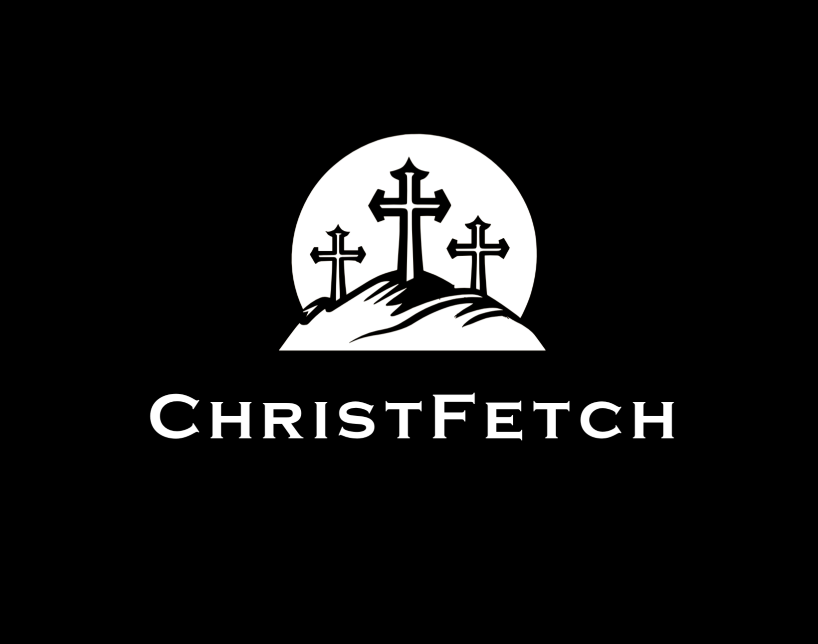
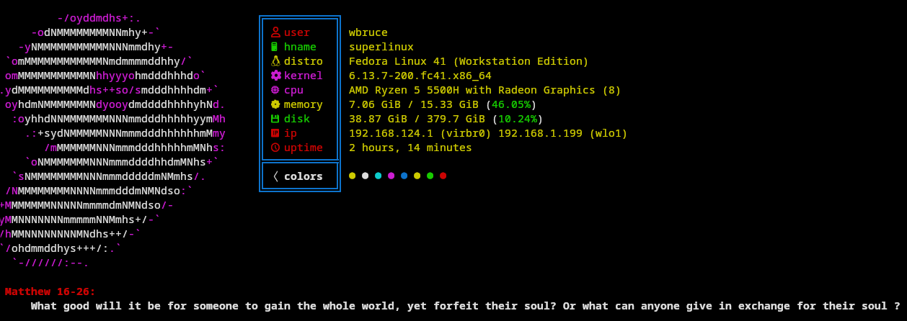
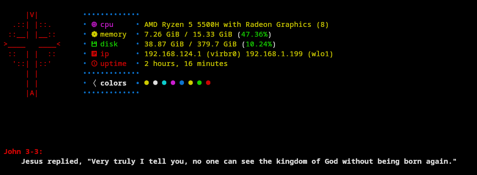
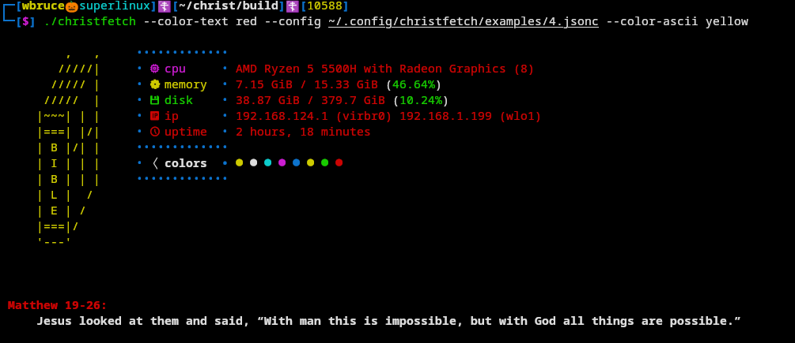
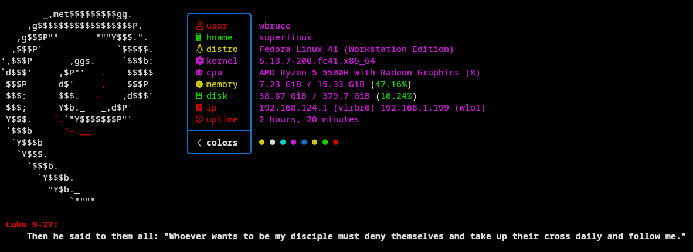

# Christfetch
  

Christfetch is a neofetch-like tool for display OS informations on the terminal. Every time christfetch is executed a random verse of the bible will be display. Written in C++ so it's speed daemon.
Currently working only on Linux.

# Examples

# Build from source : 

 Chrisfetch is written mainly in C++, `Conan` as package manager,`Cmake` as build system and `g++` for the compiler. 

 Install conan <a href="https://conan.io/downloads">here</a>

 `cd christfetch && conan profile detect --force`

 `conan install . --output-folder=build --build=missing && cd build`
  
 `cmake .. -DCMAKE_TOOLCHAIN_FILE=conan_toolchain.cmake -DCMAKE_BUILD_TYPE=Release && cmake --build .`
 

# Installation 

The easiest way to install it is by running the `run.sh` file in the christfetch folder.

Python3 is needed.

You'll need to enter your root password, the script will install the requiere tools.

The executable is named : `christfetch`, inside `build` folder.

# Customization
Display : 
    christfetch is based on a JSONC (JSON with comments) file located in ~/.config/christfetch.
      
   For now there is only gospels from Matthew, Mark, Luke, Jhon.
      
   If you want add some verse, you can by respect the following standard : 
   
           `Chapter`-`Verse number`:`space``the verse``\n`
      
   Example Inside Matthew.txt: 
   
   `10-34: Do not suppose that I have come to bring peace to the earth. I did not come to bring peace, but a sword.\n`

# Contribution
  This project NEED contribution and you can help us in many ways.

  Add gospels

  Add language

# Special Thanks

 <a href="https://github.com/fastfetch-cli/fastfetch">Fastfetch</a> - Show me how to do some stuff
